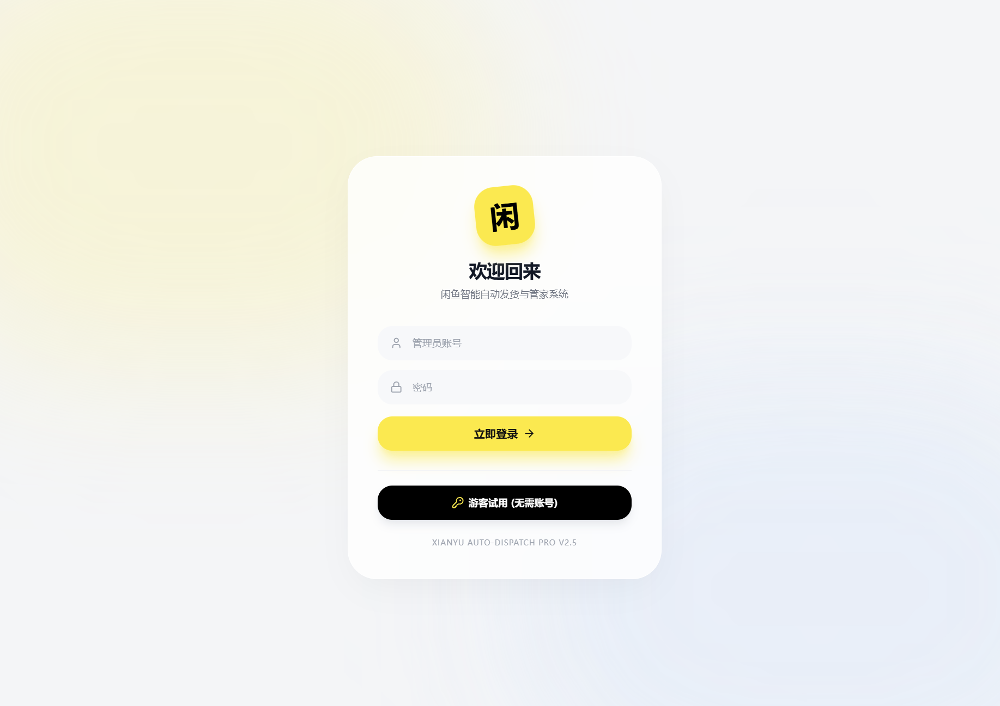
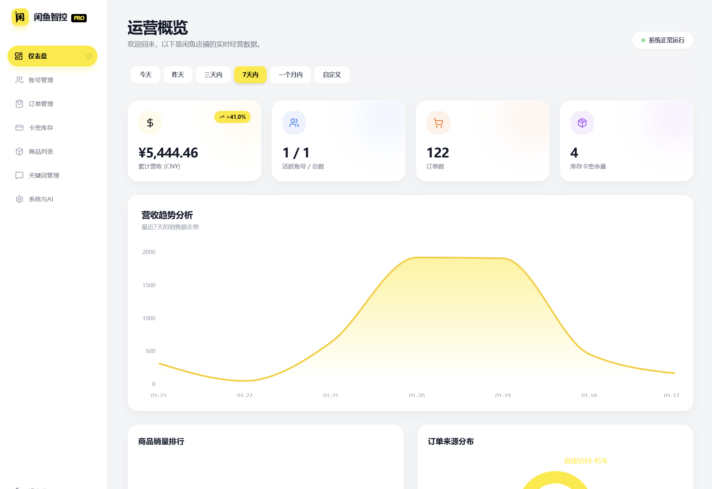
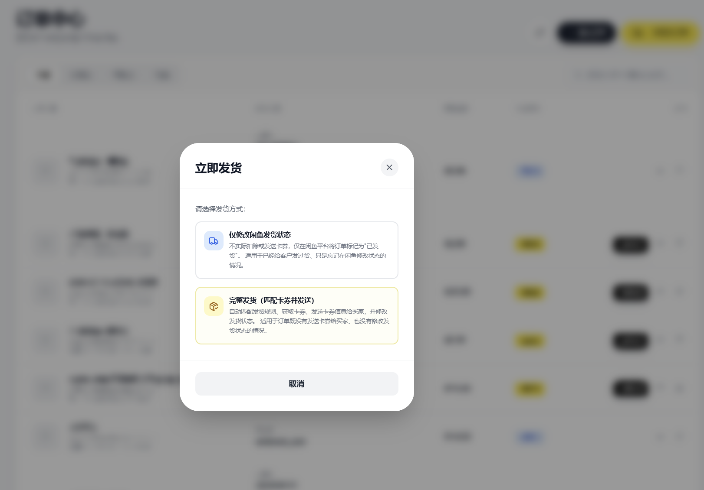

# 🐟 闲鱼超级管家

<div align="center">

**现代化的闲鱼自动回复与管理平台 - 商务专业风格 UI**

[](https://github.com/23Star/xianyu-super-butler)
[](https://opensource.org/licenses/MIT)
[](https://www.python.org/)
[](https://reactjs.org/)

基于 [zhinianboke/xianyu-auto-reply](https://github.com/zhinianboke/xianyu-auto-reply) 二次开发 · 全新 UI · 持续更新

</div>

---

## 📸 界面预览

### 工作台 Dashboard



### 订单管理 Orders



### 补发功能 - 立即发货

 

---

## 📖 简介

闲鱼超级管家是在 [xianyu-auto-reply](https://github.com/zhinianboke/xianyu-auto-reply) 基础上的二次开发版本，采用商务专业风格的全新 UI 设计，让闲鱼店铺管理更加高效便捷。

---

## ⭐ 核心功能

### 智能回复
- 🤖 关键词匹配回复
- 🧠 AI 智能议价（支持自定义折扣规则）
- 📝 默认回复配置
- 🛍️ 商品专属回复

### 自动发货
- 🚚 支持多规格商品
- ⏰ 延时发货设置
- 🎫 卡券管理
- 📋 发货规则配置

### 订单管理
- 📦 订单列表查看
- 🔄 批量刷新（并发处理）
- 🔍 订单详情查看
- 📮 收货人信息管理
- ✅ 订单状态更新

### 账号管理
- 📱 多账号支持
- 🔐 扫码/密码登录
- 🍪 Cookie 手动输入
- ⚡ 账号启用/禁用
- 🤖 AI 议价配置

### 其他功能
- 📊 数据统计与趋势分析
- 📄 Excel 批量导入导出
- 🔍 商品搜索
- 👥 多用户权限管理
- ✨ 基本解决滑块验证失败问题，成功率 99%

---

## 🚀 使用方法

### 快速启动

```bash
# 1. 克隆项目
git clone https://github.com/23Star/xianyu-super-butler.git
cd xianyu-super-butler

# 2. 安装依赖
pip install -r requirements.txt

# 3. 构建前端
cd frontend
npm install
npm run build

# 4. 启动服务（返回项目根目录）
cd ..
python Start.py

# 5. 访问应用
# 浏览器打开 http://localhost:8080
```

### 🔐 默认登录信息

```
用户名: admin
密码: admin123
```

⚠️ **安全提示：首次登录后请立即修改默认密码！**

**说明：**
- `npm run build` 会将前端打包到 `static/` 目录
- `Start.py` 启动后端服务（端口 8080），同时提供前端静态文件
- 前端已构建，无需单独运行前端开发服务器

### 前端开发模式

如需修改前端代码（支持热更新）：

```bash
# 终端1：启动后端
python Start.py

# 终端2：启动前端开发服务器
cd frontend
npm run dev

# 访问 http://localhost:3000
```

### 首次使用

1. **注册账号** - 访问 http://localhost:8080/register 创建管理员账号
2. **添加闲鱼账号** - 支持扫码登录、密码登录、手动输入Cookie
3. **配置关键词** - 为每个账号配置自动回复关键词和AI智能议价
4. **开始使用** - 系统会自动监听闲鱼消息并自动回复、自动发货

---

## 🏗️ 技术栈

**后端：** FastAPI · Python 3.11+ · SQLite · Playwright · WebSocket · Asyncio

**前端：** React 18 · TypeScript · Vite · Tailwind CSS · Framer Motion · Zustand

**性能优化：** 浏览器实例池 · 并发处理 · 智能缓存

---

## 🔄 更新日志

### ✨ 新增：订单列表单条订单操作 (2026-02-20)
- **单条订单同步** - 点击同步按钮可单独刷新该订单最新状态
- **单条订单删除** - 支持删除单条订单，带确认对话框
- **表格布局优化** - 固定列宽布局，各列宽度分配更合理

<details><summary>📁 查看历史更新</summary>

### 🐛 修复：订单刷新与筛选功能 (2026-02-13)
- **修复批量订单刷新未使用Playwright实时获取** - 添加 `force_refresh=True` 参数，确保点击"一键同步订单"时使用浏览器获取最新状态
- **修复DOM状态检测JavaScript语法错误** - 修正 while 循环条件括号位置，确保状态正确解析
- **补充缺失的状态码映射** - 添加状态码11（交易完成）和12（交易关闭）的映射
- **优化订单刷新筛选逻辑** - 简化为仅根据状态判断，稳定状态（shipped/completed/cancelled）的订单不再刷新
- **调整前端筛选选项** - 订单中心筛选改为"全部、已发货、待发货、已取消、其他"，新增"已取消"选项
- **修复后端筛选字段名不匹配** - 修正 `order_status` 为 `status`，确保筛选功能正常工作
- **简化日志输出** - 移除冗余的print语句

### ✨ 新增：补发功能 - 立即发货按钮 (2026-02-08)
- **核心功能**：点击"立即发货"后弹出自定义对话框，提供两种发货方式
  - **仅修改闲鱼发货状态**：只调用闲鱼API标记已发货，不发卡券（适用于已给客户发过货，只是忘了改状态）
  - **完整发货（匹配卡券并发送）**：匹配发货规则 → 获取卡券 → 发送给买家 → 标记已发货（适用于订单既没发卡券也没改状态）
- **Bug 修复**：
  - 修复 `aiohttp` Timeout 错误 - 不再复用运行实例的 session，改为创建独立的 `aiohttp.ClientSession`，避免跨异步上下文问题
  - 修复找不到买家 `chat_id` - orders 表新增 `chat_id` 字段，自动发货时自动存储；手动发货优先从订单取，找不到再查 `ai_conversations` 表
  - `frontend/` 重命名为 `frontend_backup/` - 当前使用的前端目录为 `xy/`
  - `vite build` 不再删除 `xianyu_js_version_2.js` - 改为 `emptyOutDir: false`，构建时保留 static 目录中的非构建文件
- **改动文件**：
  - `reply_server.py` - 重写 `/api/orders/manual-ship` 端点
  - `db_manager.py` - 新增 `chat_id` 字段、`find_chat_id_by_buyer` 方法
  - `XianyuAutoAsync.py` - 发货/标记订单时存储 chat_id
  - `xy/components/OrderList.tsx` - 新增发货方式选择对话框
  - `xy/services/api.ts` - 更新 API 类型
  - `xy/vite.config.ts` - `emptyOutDir: false`

### 🐛 修复前端加载路径问题 (2026-01-19)
- 修复 Vite 构建资源路径错误导致的白屏问题
- 修改 `frontend/vite.config.ts` 配置

### 🎨 前端UI全面重构 - 商务专业风格 (2026-01-18)
- **UI组件库重构** - Button、Card、Badge、Input、Textarea 等基础组件
- **Dashboard 2.0** - 数据统计卡片、快捷操作面板、活动流、账号概览表格
- **Orders 2.0** - 侧边详情面板设计、搜索筛选、内联编辑、批量刷新
- **Accounts 2.0** - 卡片网格布局、AI议价状态可视化、快速切换
- **配色系统** - 品牌黄 #f59e0b + 商务灰度系列

### ⚡ 性能优化 - 减少浏览器启动次数 (2026-01-17)
- **浏览器实例池** - 按账号复用浏览器实例，最多3个实例自动管理
- **合并函数优化** - 一次访问获取所有订单数据，启动次数减少50%
- **并发批量处理** - 支持5个订单并发处理，处理速度提升5倍

### 订单数据刷新功能优化 (2026-01-16)
- 智能订单刷新自动获取完整收货人信息
- 修正订单状态映射逻辑（退款成功、系统关闭）
- 数据完整性检查优化

</details>

---

## 🤝 贡献指南

欢迎提交 Issue 和 Pull Request！

1. Fork 本仓库
2. 创建特性分支 (`git checkout -b feature/AmazingFeature`)
3. 提交更改 (`git commit -m 'Add some AmazingFeature'`)
4. 推送到分支 (`git push origin feature/AmazingFeature`)
5. 提交 Pull Request

---

## 📄 开源协议

[MIT License](https://opensource.org/licenses/MIT)

> ⚠️ **免责声明**
>
> 本项目仅供学习研究使用，严禁用于商业用途！
>
> 使用本项目时请遵守相关法律法规，因使用本项目而产生的一切后果由使用者自行承担。

---

## 📊 Star History

[](https://star-history.com/#23Star/xianyu-super-butler&Date)

---

<div align="center">

**如果对您有帮助，请给个 Star ⭐**

Made with ❤️ by [23Star](https://github.com/23Star)

基于 [xianyu-auto-reply](https://github.com/zhinianboke/xianyu-auto-reply) 开发

</div>
